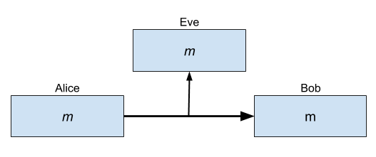
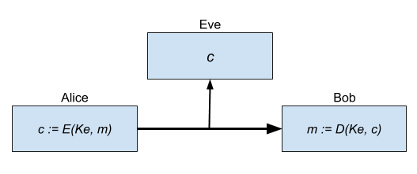
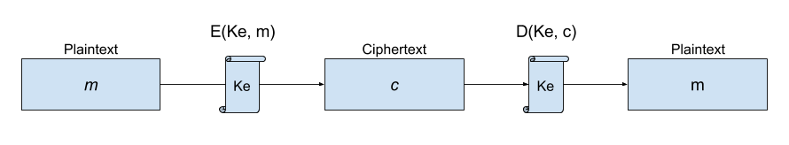
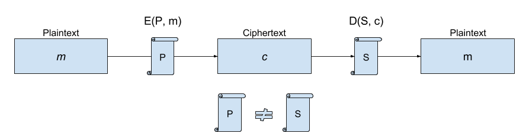
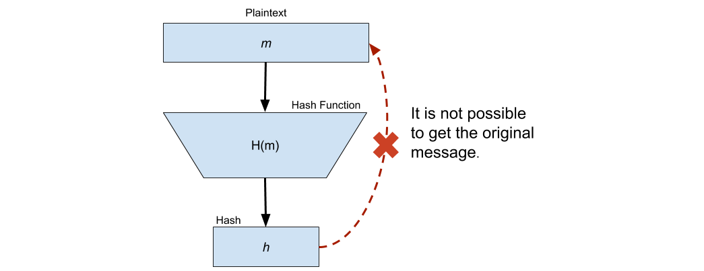
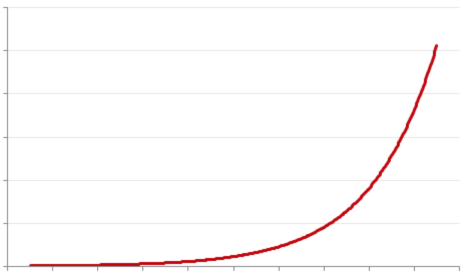

# *Crypto` &security`

##### The least you should know about Cryptography and Security

---

> Knowing how a camera works does not make you a great photographer. Knowing what cryptographic designs are and how they work does not gives you proficiency in using cryptography.

#
#

## Think as a Cryptographer does

---


# Agenda

- ~~History~~
- Introduction and Principles
- Algorithms
- - Symmetric Key
- - Asymmetric Key
- - Hashing
- - Prime Numbers & Prime Factorization
- __Real World Applications__
- __Think as a Cryptographer does__
- - Professional Paranoia
- - The Weakest Link

---

# Introduction and Principles

`Cryptography` is an extremely varied field, including Computer Security, higher algebra, economics, quantum physics, civil and criminal law, statistics, chip design, extreme software optimization, politics, user interfaces and everything between.

##### It has to be part of a much greater system in order to be useful.


---

## Definition

`Cryptography` is the art and science of encryption, which allows a sender to _disguise_ data for secure communication so that an intruder can't gain information from the intercepted data.

It has to be...
- Reliable
- Secure 

###### Not to be confused with Cryptology, which is a broader subject consisting of two branches: _Cryptography_ and _Cryptoanalysis_

---

# 

`Alice` and `Bob` want to communicate with each other. However, communication channels are assumed not to be secure.

`Eve` is eavesdropping on the channel. Any _message `m`_ that `Alice` sends to `Bob` is also received by `Eve`.

### How can `Alice` and `Bob` communicate securely?

---

# 

To prevent `Eve` from understanding the conversation that `Alice` and `Bob` are having, they use encryption.

`Alice` and `Bob` first agree on a _secret key `Ke`_ and a _encryption and decryption algorithm `E(), D()`._

### Instead of sending a _plaintext message `m`_, they are communicating using the _ciphertext `c`_.

---

#### What encryption methods or algorithms do you know?

###### Let's design one!

---

## Symmetric Key

# 

The _encryption key `Ke`_ is used to Encrypt and Decrypt the message.

---

## Symmetric Key

# 

- Fairly simple
- You should be extremely careful with to whom you are sharing it with (and how it will be stored)
- There is no way to allow unknown third-parties to send encrypted messages to you without exposing the key.

---

## Asymmetric Key

# 

The encryption key consist of two components. Secret Key `S` and the Public Key `P`.

###### Even though the Private Key `S` is derived from the Public Key `P`, they are not the same.

---

## Asymmetric Key

# 

- Broadly used in the modern technology stack
- Third-parties are allowed to send encrypted messages to you without exposing the key.
- Everything depends on how secure the Secret Key is stored

---

## Hashing

# 

A _hash function `H()`_ is a function that takes as input an _arbitrarily long string of bits `m`_ and produces a fixed-size result `h`.

###### It's important to know that there is no way back from the hash result `h` to the original message `m`.

---

#### Why anyone would use a Hash Function if the result __cannot__ be decrypted back?

###### Yes, I'm asking You...


---

# 

---

## Hashing


They are actually useful:
- Having a fixed-size result facilitates _signing_ and comparisons
- Allows you to save _the message_ without actually knowing what it is or what does it says. _(hint: passwords)_
- Works as a glue for several cryptography systems

---

## Prime Numbers

A `prime number` is a natural number greater than 1 that has no positive divisors other than `1` and `itself`.

#

__1 2 3__ 4 __5__ 6 __7__ 8 9 10 __11__ 12 __13__ 14 15 16 __17__ 18 19 20 21 22 __23__ ...

---

## Prime Numbers

Even though there are infinitely many `Primes`, verifying them becomes more complex and _costly_ as the number grows.

The simplest way to verifying the `primality` of a given number `n` is known as trial division. It consists of testing wether `n` is a multiple of any integer between 2 and `sqrt(n)`.

###### As of January 2016, the largest known prime number has 22,338,618 decimal digits.

---

## Prime Factorization

Finding which `prime numbers` multiply together to make the original number.
`````
Calculate the prime factorization of 12.
Prime Numbers: 1, 2, 3, 5, 7, 11, 13, 17, 23, ...
`````

$$12 \div 2 = 6$$
$$6 \div 2 = 3$$
$$3 \div 3 = 1$$

$$12 = 2 \times 2 \times 3$$

###### ! There is one and only one prime factorization for each number.
---

## Prime Factorization

`````
Calculate the prime factorization of 147.
Prime Numbers: 1, 2, 3, 5, 7, 11, 13, 23, ...
`````

$$147 \div 2 = 73.5$$
###### The result should be an integer, `2` is discarded.
$$147 \div 3 = 49$$
$$49 \div 7 = 7$$
$$7 \div 7 = 1$$

$$147 = 3 \times 7 \times 7$$

---

## Prime Factorization

`````
What about 721261014729547490954452378504349240996938
21481867654600825000853935195565259214555887054230207
51421525921455588705423020752592145558870542302072222?
`````


###### hmmm....

---

## Prime Factorization

# 

Computational cost grows exponentialy as the number goes bigger

---

## Prime Factorization
###### Lets cheat!
#
Chose two random, equal _bit size_ `primes`
````
p1 = 1500450271
p2 = 3267000013
````
Multiply them:
````
n = p1*p2 = 4901971054862853523
````

Now we know the _Prime Factorization_ of `n` and it's unique.


---

## Euler's totient function (Phi Function)

Counts the positive integers up to a given integer `n` that are relatively prime to `n`.

$$ \Phi(8) = 4 $$
`1, 2, 3, 4, 5, 6, 7, 8` -> `1, 3, 5, 7` -> __`4`__

#

$$ \Phi(7) = 7-1=6 $$
`1, 2, 3, 4, 5, 6, 7` -> `1, 2, 3, 4, 5, 6` -> __`6`__

#
Phi of any `Prime` is equal to `Prime - 1`.
$$ \Phi(21377) = 21376 $$

---


## Euler's totient function (Phi Function)

Phi function is _multiplicative_, which means...
$$ \Phi(AB) = \Phi(A)\Phi(B) $$

Remember our last Prime Factorization?
$$ n = p_1 p_2 $$

$$ \Phi(n) = (p_1-1)(p_2-1) $$

#

$$ \Phi(4901971054862853523) = 1500450270 \times 3267000012$$
$$ = 4901971050095403240 $$

---

## Now, Magic... or Sorcery?

$$ m^{\Phi(n)} \equiv 1 \: mod \: n $$
$$m=5, n=8$$
$$ 5^{\Phi(8)} \equiv 1 \: mod \: 8 $$
$$ 625 = 1 \: mod \: 8 $$
$$ {625}\div{8} = 624 \frac {1}{8}$$ 
$$ 625 \: mod \: 8 = 1$$

---

###### Wait!, there is more...

$$ 1^k = 1 $$
$$ m^{k\Phi(n)} \equiv 1 \: mod \: n $$
$$ 5^{2\Phi(8)} \equiv 1 \: mod \: 8 $$
$$ 390625 = 1 mod 8 $$
$$ {390625}\div{8} = 48828 \frac {1}{8}$$ 
$$ 390625 mod 8 = 1$$

---

###### Wait!, there is more...

$$ 1m = m $$

$$ mm^{k\Phi(n)} \equiv (1\times m  ) \: mod \: n  $$

$$ mm^{k\Phi(n)} \equiv m \: mod \: n  $$

$$ m^{k\Phi(n)+1} \equiv m \: mod \: n  $$

$$ m^{ed} \equiv m \: mod \: n  $$

$$ ed = k\Phi(n)+1 $$

$$ d = \frac {k\Phi(n)+1} {e} $$

`d` is our `Private Key S` and `e` is our `Public Key P`

---
## Generating Keys

Given
$$ p_1 = 53, p_2 = 59, n=3127 $$
$$ \Phi(n) = 3016 $$

Chose an encryption key `e` and an arbitrary factor `k`
$$ e = 3, k=2 $$

$$ d = \frac {2(3016)+1} {3} = 2011 $$

`d` is now our Secret encryption key.
`e` and `n`form together our _Public Key_ and we can send it to `Alice`

---

## Encrypting `89`

Given
$$ m = 89, n=3127, e = 3 $$

$$ c = 89^3 \: mod \: 3127 = 1394$$

The encrypted number will be `1394`

---

## Decrypting `1394`
Using the Private Key `d`
$$ d = 2011 $$
$$ 1394^{2011} \equiv 89 \: mod \: 3127$$

$$ 1394^{2011} = REALLY BIG NUMBER $$

$$ REALLY BIG NUMBER \: mod \: 3127  = 89$$

---

# Real World Applications
###### Enough of ur fancy maths ya' clever homeless man...

---

## SSL TLS
`Transport Layer Security` is a cryptographic protocol that provides communications security (`privacy` and `data integrity`) over a computer network.

`[Secure] https://....`
#

- Asymmetric Crypto (Authentication A.K.A _handshake_ w/ __AES__)
- Symmetric Crypto (Data Transmition w/ __RSA__)
- Hashing (Integrity Check w/ __HMAC__)
- __Relies on a set of trusted third-party certificate authorities__

#

###### Protocols can vary depending TLS version.
---

## Password Hashing
###### Who's system is storing Passwords as plain text?
###### Why is not a good idea to `encrypt` them?

---

## Password Hashing

You don't need to know the original value to verify if two given password strings are identical.
#### You only need to know that __they are identical__.
#

````javascript
const stored = hash('123456');
// stored === 'A7FB9...041C' <-- This is stored in DB

// Next time you have to validate if passwords match
stored === hash(userPassword); 
````

---

## Password Hashing


- __Slow__ is a must.
Prevent `brute force attacks` from working.
- The algorithm must be __secure__
Prevent `collisions`, enough `randomness`
- Use a `Salt` and `Iterations`
Those parameters will make your hashed string unique from the rest of the world using the same algorithm

- - bcrypt
- - PBKDF2

---

## SAT - Hacienda
`Secretaria de Hacienda y Credito Publico (SHCP)` and it's `Servicio de Administracion Tributaria (SAT)` relies on Cryptography systems.
- Invoices uses `Digital Sign`
- e.firma as a Aymmetric Key w/ Cert.

---

## JSON Web Tokens
Tokens are `signed` using HMAC256.

The `Header` and the `Payload` are encoded to Base64URL, then concatenated, and then, along with a `secret` are passed to the `HMAC256` Hash Function to generate a `Digital Signature` that will authenticate the token.

The signature is the last component of the JWT (header.payload.signature)

---
- Cryptocurrencies & Blockchains
- PGP
- Token
- - Stored Payment Data
- - Cookies and session data
- Tor & Dark Web
---

# How it looks in Node.js?
###### An small set of code examples

---

## HMAC256
````javascript
const crypto = require('crypto');

const secret = 'abcdefg';
const hash = crypto.createHmac('sha256', secret)
                   .update('WHAT WE WANT TO HASH')
                   .digest('hex');
console.log(hash);
// Prints:
//   c0fa1bc00531bd78ef38...a959d6658e
````

---

## AES192 `Encrypt`
````javascript
const crypto = require('crypto');
const cipher = crypto.createCipher('aes192', 
				   'a password');

let encrypted = cipher.update('plain text', 
			      'utf8', 
                  	      'hex');
encrypted += cipher.final('hex');
console.log(encrypted);
// Prints: ca981be48e90867...ed84d815504
````

---
## AES192 `Decrypt`

````JavaScript
const crypto = require('crypto');
const decipher = crypto.createDecipher('aes192', 
				       'a password');

const encrypted =
    'ca981be48e90867604588...b10616ed84d815504';
let decrypted = decipher.update(encrypted, 'hex', 'utf8');
decrypted += decipher.final('utf8');
console.log(decrypted);
// Prints: plain text
````

---

# Professional Paranoia
###### You have to think like a malicious attacker to find weaknesses in your own work.

Once you start thinking about how to attack your systems, you apply that to everything around you.

---

# Professional Paranoia

###### You suddenly see how you could cheat the people around you, and how they could cheat you.

Developing this mindset will help you observe things about systems and your environment that most other people don't notice.

---

# The Weakest Link
#
#
### A security system is only as strong as its weakest link.

#
#
###### Print the sentence above in a very large font and paste it along the top of your monitor.

---

# The Weakest Link

Every security system consists of a large number of parts. We must assume that our opponent is smart and that he is going to attack the system at the weakest part.

It doesn't matter how strong the other parts are.


###### Think about your users writing down their passwords in a sticky note...

###### ... What if the Super Admin does that as well?
---

# The Weakest Link

Adding cryptography to your systems without previous analysis will lead to failure.

###### Imagine a reinforced titanium chain that locks your house door and an open window in the backyard at the same time.

---

###### Ruben Rivera ( [@nullrocks](https://github.com/nullrocks) )

---
Based on the book:
### Cryptography Engineering
#### Design Principles and Practical Applications
###### Niels Ferguson, Bruce Schneier, Todayoshi Kohno
